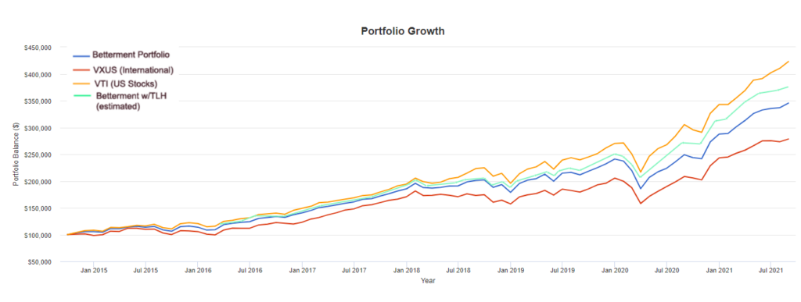
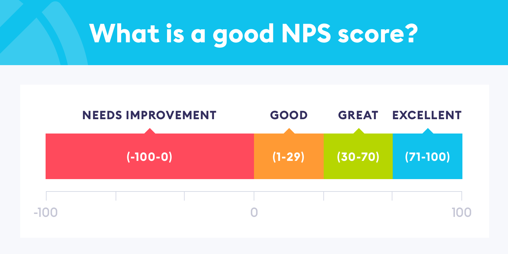

# Betterment - Automated Investment Management

## Overview and Origin

* Betterment is a finech company headquatered in New York of USA. It is one of the largest independent online financial advisor withautomated investment management in the USA which provides digital investment, retirement and cash management services. 

* Betterment was founded in 2008 in New York City by Jon Stein, a Columbia Business School MBA graduate, and Eli Broverman, a lawyer out of NYU School of Law. Betterment, LLC was established as a Delaware corporation on April 7, 2009.The parent company for Betterment LLC and Betterment Securities, Betterment Holdings, Inc. was established in Delaware on January 29, 2008.

* The idea for Betterment emerged from their recognition of inefficiencies and challenges in the traditional investment and financial advisory industry. The founders sought to leverage the advancement of emerging technology to create a more streamlined and user-friendly approach to investing.

* How is the company funded? How much funding have they received?
The company launched at TechCrunch Disrupt New York in June 2010, and won the award of "Biggest New York Disruptor". Within 24 hours, Betterment had attracted nearly 400 early customers, and the company starts to raise several rounds of funding from various investors as below:

    1. Series A: Betterment announced its Series A funding in 2010, raising $3 million. The round was led by Bessemer Venture Partners.

    2. Series B: In 2012, Betterment secured $10 million in a Series B funding round. Menlo Ventures led the investment, with participation from Bessemer Venture Partners.

    3. Series C: In 2014, Betterment raised $32 million in a Series C funding round. The round was led by Kinnevik, and existing investors participated.

    4. Series D: In 2015, Betterment announced a $60 million Series D funding round. The series D round was led by Francisco Partners, a technology-focused private equity firm. Existing investors Bessemer Venture Partners, Menlo Ventures and Northwestern Mutual also contributed.

    5. Series E: In 2016, Betterment announced a $100 million Series E round of funding. This round was one of the largest in the robo-advisor industry at the time. The Swedish growth-stage investment firm, Kinnevik once again led the round, and other investors, including Bessemer Venture Partners, Anthemis Group, Menlo Ventures, and Francisco Partners, participated. Next Year, Betterment has received a $70m extension to its Series E in 2017, led by Kinnevik and also involving participation from existing investors.

    6. Series F: In 2021, Betterment riased $60 million equity round, led by Treasury, with participation from existing investors, including Kinnevik, Bessemer Venture Partners, Francisco Partners, Menlo Ventures, Anthemis Group, Globespan Capital Partners, Citi Ventures, and The Private Shares Fund, as well as new investors Aflac Ventures and ID8 Investments. In addition, Betterment also secured a $100 million credit facility established with ORIX Corporation USA’s Growth Capital group and Runway Growth Capital.

## Business Activities

* Betterment aims to focus on simplifying and improving the investment process for individuals, addressing several financial challenges and inefficiencies in traditional financial advisory services, which includes: **1) Complexity in Investing; 2) High Fees in Traditional Financial Services; 3) Lack of Transparency; 4) Goal-Based Investing; 5) Limited Access to Financial Advice; 6) Low Tax Efficiency.**

* By addressing these challenges, Betterment aims to make investing more approachable, cost-effective, and tailored to individual financial goals, ultimately providing a solution for a broad range of investors, from beginners to those with more experience in the financial markets.  As of December 2022, Betterment had more than $32 billion of assets under management and over 775,000 customer accounts.

* Betterment differentiates itself from competitors through a combination of features and strategies designed to provide a unique value proposition:
    1. Goal-Based Investing;
    2. Automated Tax-Efficient Strategies;
    3. Smart Saver and Cash Management;
    4. Personalized Advice and Guidance;
    5. Transparent Fee Structure;
    6. Comprehensive Financial Planning Tools.

    Moreover, **Early Market Entry**, **Brand Recognition** and **Continuous Innovation** are other factors contribute to its competitive edge in the robo-advisory and financial technology space.

* Betterment has a history of continuous innovation, regularly introducing new features, technologies, more comprehensive financial planning tools and improvements to its platform. This commitment to innovation allows Betterment to stay competitive and adapt to evolving investor needs and industry trends. So far, Betterment has well used following technologies to enhance the overall user experience:
    1. Robo-Advisory Algorithms: Betterment relies on robo-advisory algorithms to automate the investment process. These algorithms analyze user-provided data, such as risk tolerance, financial goals, and time horizons, to create and manage diversified portfolios of low-cost index funds or ETFs.
    2. Cloud Computing: Many fintech companies, including robo-advisors, leverage cloud computing services for scalability, flexibility, and cost-effectiveness. Cloud platforms like Amazon Web Services (AWS) or Microsoft Azure may be used to host and manage Betterment's infrastructure.
    3. Security Measures: Given the sensitive nature of financial data, robo-advisors prioritize robust security measures. This may include encryption protocols, secure data storage practices, and multi-factor authentication to protect user information.
    4. Machine Learning and AI: Some robo-advisors incorporate machine learning and artificial intelligence (AI) to enhance their algorithms. These technologies can improve the personalization of investment recommendations and contribute to more sophisticated risk management.
    5. API Integrations: Fintech platforms often use application programming interfaces (APIs) to integrate with third-party services and financial institutions. This can include integrations with banks for account linking, data aggregation services, and other financial tools.
    6. Continuous Integration/Continuous Deployment (CI/CD): CI/CD practices facilitate the rapid and reliable deployment of software updates. This is essential for maintaining a responsive and up-to-date platform.

## Fintech for Automated Investment Management Landscape

* Betterment was one of the early entrants in the robo-advisory industry, establishing itself as a pioneer in the automated investment management space. It is a significant player utilizing advanced fintech in financial services domain, specifically in the wealth management and investment advisory and management.

* Over the last 5-10 years, the robo-advisory and investment management industry has experienced significant growth and witnessed various trends and innovations. Here are some of the major developments:
    1. **Widespread Adoption of Robo-Advisors.**
    2. **Hybrid Models** and Traditional Firms entering the space.
    3. **Goal-Based Investing** allowing users to set specific financial objectives, such as saving for retirement, a home, or education. This approach personalized investment strategies based on individual goals and time horizons.
    4. **Expansion of Features and Services** beyond basic investment management. Additional features include tax-loss harvesting, retirement planning tools, socially responsible investing options, and more, providing users with a comprehensive financial planning and social experience.
    5. **Customization and Personalization** in the algorithms. This involved considering individual risk tolerance, preferences, and financial goals to tailor investment portfolios for users.
    6. **Integration of Artificial Intelligence (AI) and Machine Learning (ML)** allow for more sophisticated data analysis, pattern recognition, and personalized insights, contributing to improved investment strategies。
    7. **Cash Management Solutions** allows users to earn interest on their cash balances while maintaining liquidity, providing an alternative to traditional savings accounts.
    8. **Emphasis on Financial Education** helps users make informed decisions and understand the principles behind their investment strategies.
    9. **Regulatory Developments** adapted to ensure consumer protection, disclosure, and compliance with financial regulations, contributing to the legitimacy and trustworthiness of the robo-advisory industry.
    10. **Industry Consolidation** aimed to achieve economies of scale and enhance competitiveness.

* This landscape is dynamic, and with technologies and industry advancement, many new players have emerged. Here are some notable robo-advisory and investment management companies:
    1. **Wealthfront**: Wealthfront is a robo-advisor that offers automated investment management services, tax-efficient strategies, and financial planning tools.

    2. **Vanguard** Personal Advisor Services: Vanguard, a well-known investment management company, offers a hybrid robo-advisor service that combines automated investment management with access to human financial advisors.

    3. **Schwab Intelligent** Portfolios: Charles Schwab's robo-advisor platform provides automated investment management and a range of diversified portfolios.

    4. **Fidelity** Go: Fidelity offers a robo-advisor called Fidelity Go, providing users with automated investment services and low-cost portfolios.

    5. **SigFig**: SigFig is a robo-advisor that partners with traditional financial institutions to offer automated investment services. It also provides tools for portfolio tracking and analysis.

    6. **Personal Capital**: Personal Capital combines robo-advisory services with access to human financial advisors. It offers tools for wealth tracking, budgeting, and retirement planning.

    7. **E-TRADE** Core Portfolios: E-TRADE's robo-advisor, Core Portfolios, provides automated investment management services with a focus on low fees.

    8. **Ally Invest** Managed Portfolios: Ally Invest offers a robo-advisor service that provides automated portfolio management and a range of investment options.

    9. **Acorns**: Acorns is known for its micro-investment approach, rounding up users' everyday purchases to invest the spare change. It aims to make investing accessible to individuals with small amounts of money.

    10. **Robinhood**: While initially known for its commission-free stock trading, Robinhood has expanded its services to include a robo-advisor feature, allowing users to invest in portfolios based on their risk preferences.

    11. **M1 Finance**: M1 Finance is a platform that combines robo-advisory services with customizable portfolios, allowing users to create and manage their investment pies.

## Results

* So far, Betterment has contributed a notable business impact on the financial industry and investment:
    1. Pioneer in the Robo-Advisory Space;
    2. Increased Investors Accessibility;
    3. Offered Cost-Effective Investing；
    4. Focus on Goal-Based Investing；
    5. Innovation and Feature Expansion;
    6. Industry Evolution to increase user-friendly competition;
    7. Enhanced User Trust and Transparency in its fee structure;
    8. Industry Recognition and awarded for its innovation, user experience.

* Based on some core metrics commonly used by companies in automated investment management, Betterment performs as:
    1. Assets Under Management (AUM): 40+ billion USD (by 2023)
    2. User Growth: 

        Betterment users per year
        | Year | Number of Users| Growth |
        | ----------- | ----------- | ----------- |
        | 2012 | 10K+ |
        | 2013 | 25K | 150% |
        | 2014 | 63K+ | 152% |
        | 2015 | 142K+ | 125% |
        | 2016 | 248K+ | 75% |
        | 2017 | 392K+ | 58% |
        | 2018 | 463K+ | 18% |
        | 2019 | 542K+ | 17% |
	    | 2020 | 660K+ | 22% |
        | 2021 | 805K+ | 22% |
        | 2022 | 910K+ | 13% |
        | 2023 Aug | 1M+ | 9.9% |

    3. Revenue and Profitability: Estimated annual revenue is currently $105.8M per year with current valuation of $1.3B
    4. Average Account Size: 40k USD (by 2023)
    5. Fee Structure Metrics:  0.25% fee for individual accounts with at least $20,000 or at least $250 per month in recurring account deposits. Otherwise, the fee is $4/month. 0.40% for high net worth individual investment accounts with at least $100,000 in assets. 1% crypto fee. For accounts with at least $2 million, 0.3%.
    6. User Engagement and Client Retention Rate: Bettterment enable 91% of users to maintain a higher median account balance.
    7. Goal Achievement Rates: According to [Betterment Goal Projection and Advice Disclosure](https://www.betterment.com/legal/goal-projection), for all savings goals (except PRP goals, as noted), the goal is “On Track” when the total projected portfolio value exceeds the goal target assuming average market performance. This is equivalent to a likelihood of 50% and above of reaching the goal target. 
    
    8. Customer Satisfaction and NPS (Net Promoter Score): Betterment's Customer Loyalty score was rated 64% by Caucasian customers on Comparably. Betterment scored a 42 for Net Promoter Score, which indicates great.
    
    9. Regulatory Compliance : Betterment is registered with the Securities and Exchange Commission, and a member of the Financial Industry Regulatory Authority. It is a registered investment advisor and broker-dealer follows full regulatory compliance.

Betterment is performing as top player with awards winning records. It has become one of the most successful Robo-advisors and automated investment management with over $40 billion in assets under management and is currently among the largest Robo-advisors and automated investment management by AUM. It is trusted by thousands of U.S. investors who are seeking affordable, low-cost portfolio management services.

## Recommendations

* As a leader in automated investment management field, Betterment already offers a range of products and services in the robo-advisory, financial planning and investment management space. Considring the new trends and dynamic markets needs, there are some potential products or services that Betterment can consider:
   1. **Financial Planning for Specific Life Events:** Tailored financial planning modules for specific life events, such as buying a home, having a baby, starting a business, or funding education, to guide users through these major financial milestones.

   2. **Risk Managment and Data Tools:** With growing of investors assets in their account, more sophisticated investors, educators, companies and institutions will need more risk monitoring and big data analysis and modeling tools.

    3. **Robust Tax Planning Features:** Advanced tax planning tools that go beyond tax-loss harvesting, offering features such as tax-efficient withdrawal strategies, tax-efficient charitable giving options, and other tax optimization strategies.

    4. **Alpha Seeking and Generating:** For Betterment, seeking organic growth through outperformance will attract more customers attention, adopting alternative data sets and AI have proved to be a differentiating factor for generating additional alpha.

    5. **Estate Planning Integration:** Integration with estate planning services to provide users with tools for managing their estate, including wills, trusts, and beneficiary designations.

    6. **Alternative Investments:** Considering customer demand, Betterment might explore the inclusion of options for alternative investment strategies, though this would need to align with their risk management principles.

    7. **Collaboration:** Tools that facilitate collaborative financial planning for couples or families with social platform functions, allowing multiple users to contribute to and track shared financial goals.

    8. **Content Distribution and Chatbot Tools:** Customer experience is a new battleground and AI is helping advisors to generate more insights, customize content more effectively, and deliver it to clients with professional chatbot advisor and training functions with greater agility and speed.

* **Advanced Financial modeling, AI, Cloud Computing, Predictive Analytics，Natural Language Processing (NLP, chatbots), Quantum Computing and Blockchain and Smart Contracts** are game changers for automated investment management needs. Because those technologies equips companies with the tools to bolster compliance, augment and automate data analysis, alpha impacting investment factors and alternative data seeking, automate certain aspects of financial transactions and enhance the security of client data, risk management functions, and anticipate and manage ambiguous events with enhanced high speed data processing advantages and efficiency of portfolio optimization and investment strategies execution.

* Advanced machine learning algorithms and AI technologies could enhance Betterment's ability to analyze vast amounts of financial data, improve portfolio optimization, and offer more personalized investment strategies based on individual user behavior and preferences. As a robo-advisory company, predictive analytics could allow Betterment to anticipate user needs and preferences, enabling more proactive and personalized financial advice.

* Financial professionals tailored Chatbots powered by NLP could answer user queries, and offer personalized financial advice with operational improvements. Advanced automation will automate routine and repetitive tasks within the investment management process，continuously improve the efficiency of the investment firm operations and reducing the risk of errors.

All in all, by leveraging those new technologies could enhance Betterment future performance, and user benefits offerings and secure the company's seat at a competitive position.